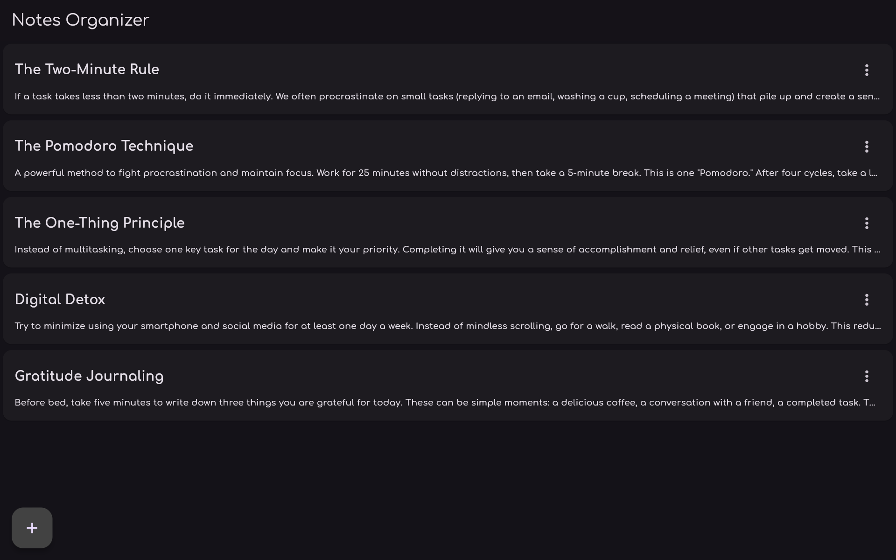

# Notes Organizer

<div align="center">
  
</div>

## About

Это простое и удобное приложение для создания и управления текстовыми заметками, разработанное на Flutter (Dart). Приложение позволяет создавать, редактировать, импортировать и удалять заметки с интуитивно понятным интерфейсом в стиле Material Design 3.

### Особенности приложения

- **Современный Material Design 3** с темной темой и анимациями
- **Кроссплатформенность**: работает на Web и Desktop
- **Полноценное управление заметками**:
  - Создание новых заметок
  - Редактирование заголовка и содержимого
  - Удаление заметок
  - Просмотр списка всех заметок
- **Умный импорт файлов** (для нативных платформ):
  - Автоматический импорт .txt файлов из выбранной папки
  - Название файла становится заголовком заметки
  - Содержимое файла переносится в текст заметки
- **Гибкое управление**:
  - Контекстное меню для каждой заметки
  - Поддержка жестов (долгое нажатие)
  - Горячие клавиши (Ctrl/Cmd + Enter для сохранения)
  - Несколько способов вызова меню: тап по иконке, долгое нажатие, правый клик

### Интерфейс

Приложение состоит из следующих основных элементов:

1. **Главный экран**:

   - Список всех заметок в виде карточек
   - Заглушка "No Notes yet..." при пустом списке
   - Плавающие кнопки действий

2. **Элементы заметки**:

   - Заголовок (жирный шрифт)
   - Превью текста (первые символы)
   - Иконка меню с действиями

3. **Диалоговые окна**:

   - Добавление новой заметки (только заголовок)
   - Редактирование заметки (заголовок и текст)
   - Контекстное меню действий

### Технические детали

- **Язык программирования**: Dart
- **Фреймворк**: Flutter
- **Целевые платформы**: iOS, Android, Web, Windows, macOS, Linux
- **Архитектура**: Widget-based с state management
- **Шрифт**: Comfortaa
- **Иконки**: Material Icons + кастомные иконки

## Installation

### Предварительные требования

Убедитесь, что у вас установлены:

- Flutter SDK (последняя стабильная версия)
- Dart SDK
- Подходящая IDE (VS Code, Android Studio)

### Установка и запуск

0. **Клонирование репозитория:**

```bash
git clone https://github.com/your-username/notes-organizer.git
cd notes-organizer
```

1. **Установка зависимостей:**

```bash
flutter pub get
```

2. **Запуск приложения:**

```bash
# Для web-версии
flutter run -d chrome

# Для Windows
flutter run -d windows
```

3. **Сборка релизной версии:**

```bash
# Для web
flutter build web

# Для Windows
flutter build windows
```

### Основные виджеты

- **`MainApp`** - корневой виджет приложения
- **`MainHomePage`** - главный экран со списком заметок
- **`NotePreview`** - карточка предпросмотра заметки
- **`AddNoteDialog`** / **`EditNoteDialog`** - диалоги управления заметками
- **`AddNoteButton`** / **`ImportFilesButton`** - кнопки действий

## Credits

- **Иконки**: [Flaticon](https://www.flaticon.com/)
  - [Sticky notes icons (by _Freepik_)](https://www.flaticon.com/free-icon/sticky-notes_3209265)
  - [Paper icons (by _Pixel perfect_)](https://www.flaticon.com/free-icon/post-it_889669)
- **Шрифт**: [Comfortaa](https://fonts.google.com/specimen/Comfortaa) от Google Fonts
